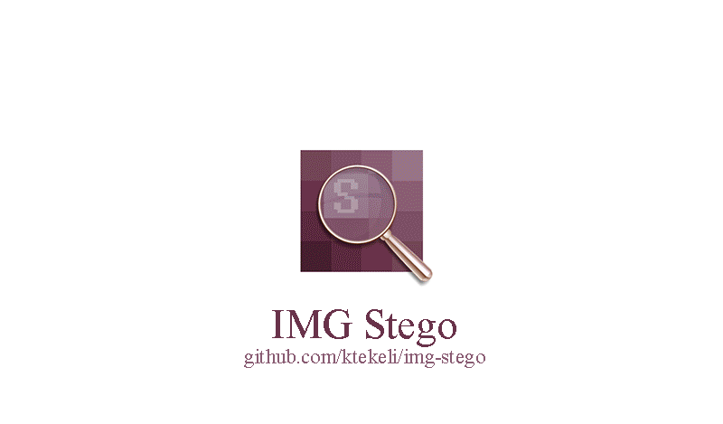

# img-stego

> A complete desktop application to hide any kind of data inside bitmap images.

## Description

This program is a simple example for blind image [steganograpy](https://en.wikipedia.org/wiki/Steganography) using Least Significant Bit ([LSB](https://en.wikipedia.org/wiki/Bit_numbering#Least_significant_bit)) substitution. It lets the user hide any kind of data into 24-bit bitmap images on a GUI.

  

## About

This desktop app was developed as a part of my MSc Seminar in 2015, and it is shared on github to be helpful for other users.

It is possible to hide either text messages or any kind of files by switching the option with the radio buttons in the application.

Necessary information about hidden data such as text length (for text messages), size of file, file name, length of file name (for files) is embedded within the data. This is done by using the same LSB algorithm by replacing image pixels in reverse.

Two predefined string codes "tt1" and "tb1" are embedded into the image to recognize the type of hidden data in decoding step. This operation is to check if there is any information in the stego file, and if so to decide which kind of data exists in it. "tt1" is encoded at the end of the cover image if hidden data is a text message, or "tb1" is used if the hidden data is a file which contains its original file name to be used in decoding. Extraction method is chosen automatically using these string codes in order to avoid confusions.

## Requirements

This program was developed in Visual Studio 2015 with C# language under Windows 7. So, it needs .NET framework.

## Usage

This project is uploaded as a form application, and compiled [binary file](https://github.com/ktekeli/img-stego/releases/download/v1.0/IMG-Stego.exe) for Windows is attached in the release v1.0.

**Embedding Text**

> Embedding>Embed Text>Browse>Choose Image>Type Message>Embed>Save As

**Embedding File**

> Embedding>Embed File>Browse>Choose Image>Open File>Embed>Save As

**Extraction**

> Extraction>Browse>Choose Stego Image>Extract

It is an open-source project. Users can edit [the solution](https://github.com/ktekeli/img-stego/blob/master/src/IMG-Stego.sln) file in Visual Studio as needed and recompile.

## Bugs

Application works properly for 24-bit bitmap images. I have not added a conditional statement to check for 24-bit. It can be done if needed. Source code was written in Turkish, and it has been translated for github recently. So, there can be some left-overs in the code. I was a newbie in C#back then, so there may be shorter solutions or other bugs in the program. Feel free to report an issue or pull request for possible improvements.

## License

[MIT License](https://github.com/ktekeli/img-stego/blob/master/LICENSE) | &copy; 2015 Kadir Tekeli

## Contribution

Contributions are always welcome!

1. Fork it!
2. Create your feature branch: (`git checkout -b my-new-feature`)
3. Commit your changes: (`git commit -am 'Add some feature'`)
4. Push to the branch: (`git push origin my-new-feature`)
5. Submit a pull request.

## See Also

A matlab library with several basic [audio steganography algorithms](https://github.com/ktekeli/audio-steganography-algorithms).
